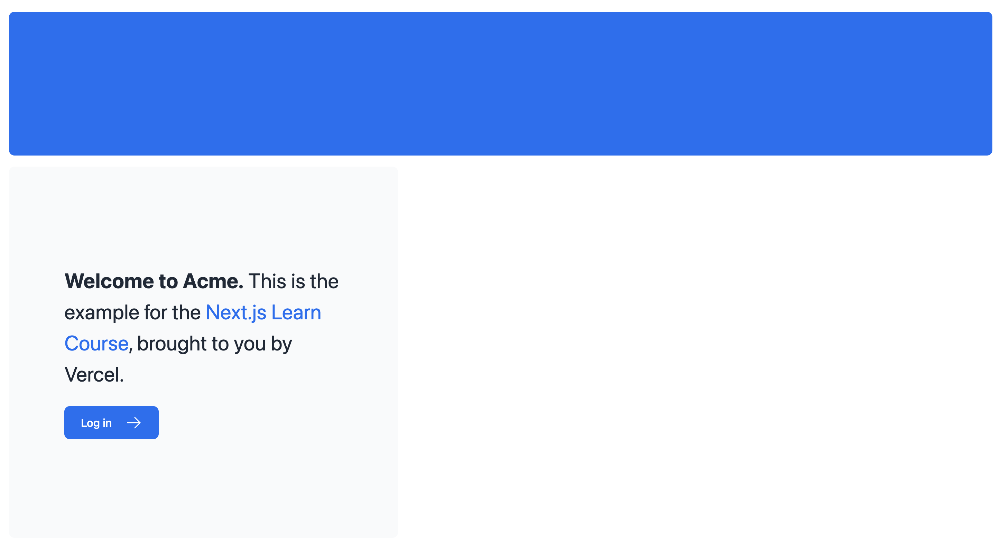

# [CSS 스타일링](https://nextjs.org/learn/dashboard-app/css-styling)

## 목차

- App에 글로벌 CSS 파일을 추가하는 방법
- 두 가지 스타일링 방법: tailwind / CSS module
- `clsx` 유틸리티 패키지로 조건부 클래스 변경 추가

<br/>

---

### 글로벌 스타일

`/app/ui/global.css`에 정의한다. CSS reset rule이나 HTML 요소에 대한 스타일을 정의하여 프로그램 전체에 적용되는 규칙을 추가할 수 있다.

모든 컴포넌트에서 global.css의 스타일을 가져올 수 있지만 일반적으로 최상위 컴포넌트에 추가하는 것이 권장된다. 이 최상위 컴포넌트가 Next.js에서는 **root layout**이다.

`/app/layout.tsx`에서 global.css의 스타일을 가져와 보자.

```tsx
// 최상단에 import문 추가
import '@/app/ui/global.css';

//...
```

그러면 갑자기 사이트가 예뻐진다.



### Tailwind

이 스타일들은 어디서 온 것일까? `global.css` 상단을 보면 tailwind directives가 있는 걸 알아차릴 수 있다.

```css
@tailwind base;
@tailwind components;
@tailwind utilities;
```

tailwind는 TSX 마크업에서 바로 가져와 사용할 수 있는 utility class를 제공하는 css 프레임워크다. `/app/page.tsx`를 보면 이미 Tailwind 클래스를 사용하고 있음을 알 수 있다. 이로 인해 `/app/layout.tsx`에서 global.css 스타일을 임포트하자 마자 스타일이 적용된 것이다.

`/app/page.tsx`의 `<p>` 태그 위에 아래 코드를 붙여 넣는다.

```tsx
<div className="h-0 w-0 border-b-[30px] border-l-[20px] border-r-[20px] border-b-black border-l-transparent border-r-transparent" />
```

<br/>

---

### CSS module

CSS module은 클래스를 로컬 범위로 지정하여 스타일링 충돌 위험을 줄이는 방법이다. CSS module을 사용해 Tailwind와 동일한 결과를 내보자.

`/app/ui`에 `home.module.css` 파일을 생성하고 아래의 코드를 작성한다.

```css
.shape {
  height: 0;
  width: 0;
  border-bottom: 30px solid black;
  border-left: 20px solid transparent;
  border-right: 20px solid transparent;
}
```

그런 다음 `page.tsx로 돌아가` styles를 임포트 해주고 아까 추가했던 div 박스의 className을 styles.shape로 변경한다.

```tsx
{
  /* <div className="h-0 w-0 border-b-[30px] border-l-[20px] border-r-[20px] border-b-black border-l-transparent border-r-transparent" /> */
}
<div className={styles.shape} />;
```

<br/>

---

### clsx 라이브러리 사용하기

상태 혹은 기타 조건에 따라 요소의 스타일을 조건부로 지정해야 하는 경우가 있을 수 있다. clsx는 클래스 이름을 쉽게 전환할 수 있게 해주는 라이브러리다. [자세한 내용은 document 참조](https://github.com/lukeed/clsx)

status를 수락하는(accepts) InvoiceStatus라는 컴포넌트를 만든다고 가정하자. 이 status는 'pending' 혹은 'paid'가 될 수 있다. 만약 status가 pending이라면 색깔은 초록색으로, pending이라면 회색으로 변경할 것이다.

clsx를 사용하면 조건부 스타일을 다음과 같이 적용할 수 있다.

```tsx
import clsx from 'clsx';

<span
  className={clsx(
    'inline-flex items-center rounded-full px-2 py-1 text-xs',
    {
      'bg-gray-100 text-gray-500': status === 'pending',
      'bg-green-500 text-white': status === 'paid',
    },
  )}
>
```
