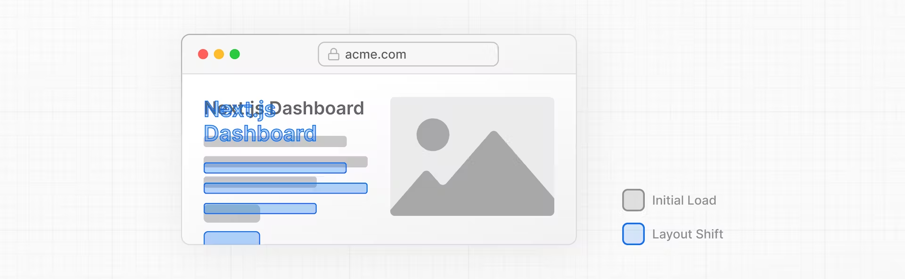
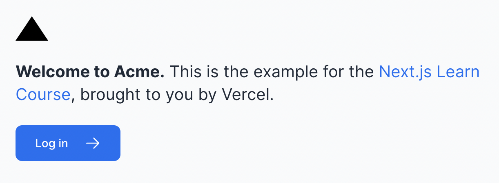

# 폰트와 이미지 최적화

## 목차

- next/font를 사용해서 커스텀 폰트를 추가하는 방법
- next/image를 사용해서 이미지를 추가하는 방법
- Next.js에서 폰트와 이미지가 최적화되는 방법

## 왜 폰트를 최적화하나요?

글꼴 파일을 가져와 로드해야 하는 경우 사용자 지정 글꼴을 사용하면 성능에 영향을 미칠 수 있다. 브라우저는 우선 **시스템 글꼴로 텍스트를 렌더링한 다음 사용자 지정 글꼴로 교체하는데 이때 레이아웃 이동이 발생**한다. 이 스왑으로 인해 텍스트 크기, 간격 또는 레이아웃이 변겨오디어 주변 요소가 이동할 수 있다.



Next.js의 **`next/font` 모듈**을 사용하면 **응용 프로그램의 글꼴이 자동으로 최적화되어 빌드 시 글꼴 파일을 다운로드하고 다른 정적 자산과 함께 호스트**된다. 즉, 사용자가 웹사이트를 방문할 때 추가 네트워크 요청을 하지 않아도 된다.

## primary font 추가

> Google Inter 폰트를 추가하자.

### 1. `app/ui` 디렉토리에 fonts.ts 추가하기

어플리케이션 전체에서 사용될 폰트는 여기에 추가될 것이다.

```tsx
import { Inter } from 'next/font/google';

export const inter = Inter({ subsets: ['latin'] });
```

### 2. `/app/layout.tsx`에 폰트 적용하기

아래 코드와 같이 폰트를 추가하고 나면 브라우저의 개발자 도구의 body element에 `Inter`와 `Inter_Fallback`이 추가된 것을 확인할 수 있다.

```tsx
// before
<body>{children}</body>

// after
<body className={`${inter.className} antialiased`}>{children}</body>
```

antialiased 클래스는 테일윈드의 클래스로 폰트를 부드럽게 만들어 준다.

no antialiased


antialiased


## (연습하기) secondary font 추가

> Lusitana 폰트를 추가하고 `/app/page.tsx`의 `<p>` 태그에 적용해 본다. font weight를 정하자.

```ts
// 정답
import { Inter, Lusitana } from 'next/font/google';

export const inter = Inter({ subsets: ['latin'] });

export const lusitana = Lusitana({
  subsets: ['latin'],
  weight: ['400', '700'],
});
```

```tsx
import { inter } from '@/app/ui/fonts';

 <p className={`${lusitana.className} text-xl text-gray-800 md:text-3xl md:leading-normal`}>
```

이제 `page.tsx`에 있는 `<AcmeLogo />`를 주석 해제할 수 있다!

<br/>

## 왜 이미지를 최적화하나요?

일반적으로, HTML 문서에서 이미지를 추가할 땐 다음과 같이 한다.

```html

```

이것은 여러가지를 수동으로 조절해야 한다는 의미다.

- 화면 크기에 따른 반응형 처리
- 디바이스 사이즈에 따른 적절한 이미지 사이즈
- 이미지를 로드하는 동안 발생하는 layout 이동
- 유저의 뷰포트 바깥에서 lazy load(실제로 화면에 보여질 필요가 있을 때 로딩하는 테크닉) 처리

`next/image`를 사용하면 이러한 최적화 포인트를 수동으로 처리하지 않아도 된다.

## `<Image>` 컴포넌트

`<Image>` 컴포넌트는 `` 태그의 확장 컴포넌트로, 자동으로 이미지를 최적한다.

- 이미지가 로딩될 때 layout 이동을 방지한다.
- 작은 화면에 큰 사이즈가 뜨지 않도록 사이즈를 조정한다.
- 기본적으로 lazy loading을 한다.
- WebP, AVIF을 지원하는 브라우저에 한해 이미지를 현대적인 포맷으로 제공할 수 있게 한다.

## 데스크탑 hero 이미지 추가하기

> hero 이미지란?  
> 한 장 만으로 있어 보이고 모든 것을 설명할 수 있는 이미지와 동영상.

### `<Image>` 컴포넌트를 사용해 이미지 추가하기

`md:block`은 반응형 스타일을 표현하는 테일윈드 클래스로, 중간 이상(medium)의 스크린 크기일 때 적용함을 나타낸다.

[Responsive Design](https://tailwindcss.com/docs/responsive-design)

```tsx
import Image from 'next/image';

export default function Page() {
  return (
    // ...
    <div className="flex items-center justify-center p-6 md:w-3/5 md:px-28 md:py-12">
      <Image
        src="/hero-desktop.png"
        width={1000}
        height={760}
        className="hidden md:block"
        alt="Screenshots of the dashboard project showing desktop version"
      />
    </div>
    //...
  );
}
```

**레이아웃 이동을 방지하기 위해 width와 height 비율은 원본 이미지의 가로 세로 비율과 동일해야 한다.**

### (연습하기) 모바일 화면의 hero 이미지 추가하기
