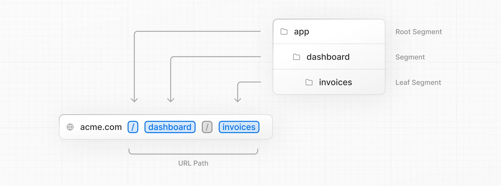
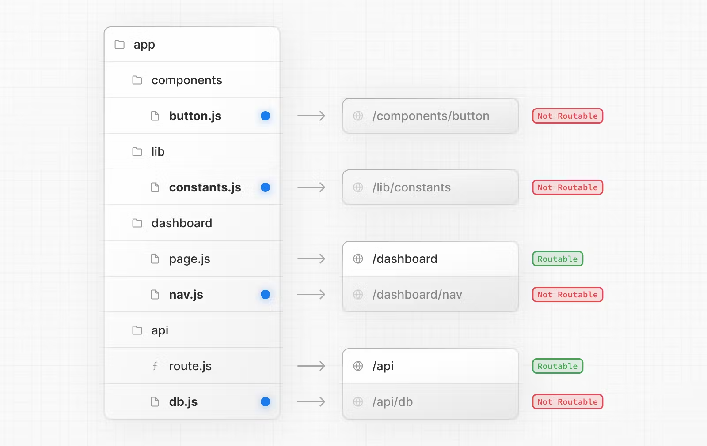
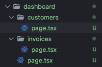
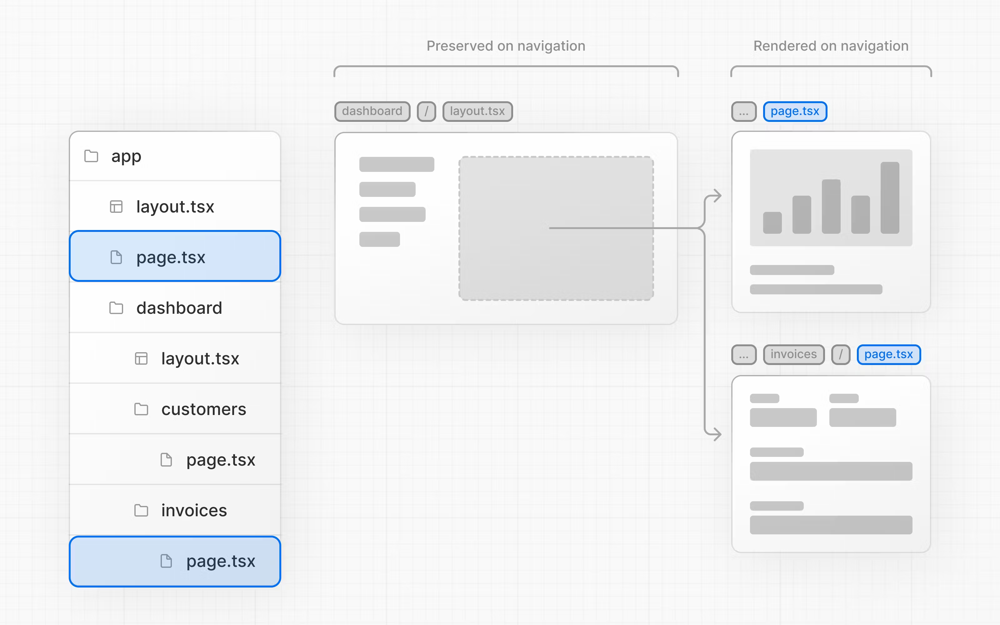

# [레이아웃과 페이지 생성하기](https://nextjs.org/learn/dashboard-app/creating-layouts-and-pages)

> 레이아웃과 페이지를 생성하고 라우팅 하는 방법을 알아 본다.

## 주제

- 파일 기반 라우트 시스템을 활용하여 dashboard 페이지 라우팅하기
- 경로에 새로운 segment를 추가할 때 폴더와 파일이 하는 역할 이해하기
- 여러 dashboard 페이지에서 공유하는 중첩 레이아웃 생성하기
- 코로케이션, 부분 렌더링, 루트 레이아웃을 이해하기

<br/>

## 중첩 라우팅(nested routing)

Next.js의 파일 기반 라우트 시스템에서 **파일은 URL의 segment와 대응된다**.



각 경로(폴더)는 `page.tsx`와 `layout.tsx`를 사용하여 별도의 UI를 생성할 수 있다. **`page.tsx`는 폴더 별로 반드시 존재해야만 하는 파일로, url 경로로 진입 가능하게 한다.**

따라서 중첩 라우팅을 원한다면 단순히 하위 폴더를 생성하고 `page.tsx` 파일을 생성하면 된다.

<br/>

## dasyboard 페이지 생성하기

`/app` 경로 아래에 `dashboard` 폴더를 생성하고 `page.tsx` 파일을 추가하자. 파일 안에는 아래의 내용을 복사해 넣는다.

```tsx
export default function Page() {
  return <p>Dashboard Page</p>;
}
```

이런 특별한 형식 덕분에 dashboard와 관련한 다른 스크립트(UI 컴포넌트, 테스트 파일들 혹은 다른 관련 코드)가 dashboard 안에 함께 위치할 수 있게 된다([colocate](https://nextjs.org/docs/app/building-your-application/routing#colocation)). **`page` 파일 안에 있는 내용만 공개적으로 접근할 수 있기 때문**이다.



<br/>

## (연습하기) dashboard 페이지에 다른 페이지 추가하기

> 두 개의 페이지를 더 추가해 보자.

2. Customoer Page: http://localhost:3000/dashboard/customers 로 접근 가능하고 `<p>Customers Page</p>`를 반환하는 페이지
3. Invocis Page: http://localhost:3000/dashboard/invoices 로 접근 가능하고 `<p>Invoices Page</p>`를 반환하는 페이지

<details>
<summary>정답</summary>



```tsx
// invoices/page.tsx
export default function Page() {
  return <p>Invoices Page</p>;
}

// customers/page.tsx
export default function Page() {
  return <p>Customers Page</p>;
}
```

</details>

<br/>

---

## dashboard 레이아웃 생성하기

**`layout.tsx`는 다수의 페이지에서 공유되는 UI를 생성할 때 사용하는 파일이다**. Dashboard 페이지는 다른 페이지로 이동할 수 있는 navigation이 필요한데, 이를 `layout.tsx`를 사용해 만들어 보자.

```tsx
import SideNav from '@/app/ui/dashboard/sidenav';

export default function Layout({ children }: { children: React.ReactNode }) {
  return (
    <div className="flex h-screen flex-col md:flex-row md:overflow-hidden">
      <div className="w-full flex-none md:w-64">
        <SideNav />
      </div>
      <div className="flex-grow p-6 md:overflow-y-auto md:p-12">{children}</div>
    </div>
  );
}
```

위 코드를 자세히 살펴 보자.

`<SideNav />` 컴포넌트 아래로 Layout에 전달된 children이 렌더링되고 있다. 이 children은 페이지일 수도 다른 레이아웃이 될 수도 있으며, 이런 상황에서는 `/dashboard` 경로 아래에 있는 페이지들이 자동으로 전달된다.

`layout.tsx`를 navigation에 사용한다면 **레이아웃의 재렌더링 없이 변경되는 페이지 혹은 컴포넌트만 [부분적으로 재렌더링](https://nextjs.org/docs/app/building-your-application/routing/linking-and-navigating#3-partial-rendering) 된다는 장점이 있다**. 이는 서버에서 데이터 전달과 실행 시간을 줄여 성능을 향상시킨다.



<br/>

---

## Root layout

Chapter 3에서 앱 전체에 폰트를 추가하기 위해 `/app/layout.tsx` 파일에 폰트를 넣어줬다. 이때 layout 파일에 있던 컴포넌트는 `RootLayout`이었는데, 여기에 추가된 컴포넌트는 모든 페이지에서 공유된다.

루트 레이아웃에서는 주로 `html`이나 `body`, 그리고 메타 데이터를 수정한다.
